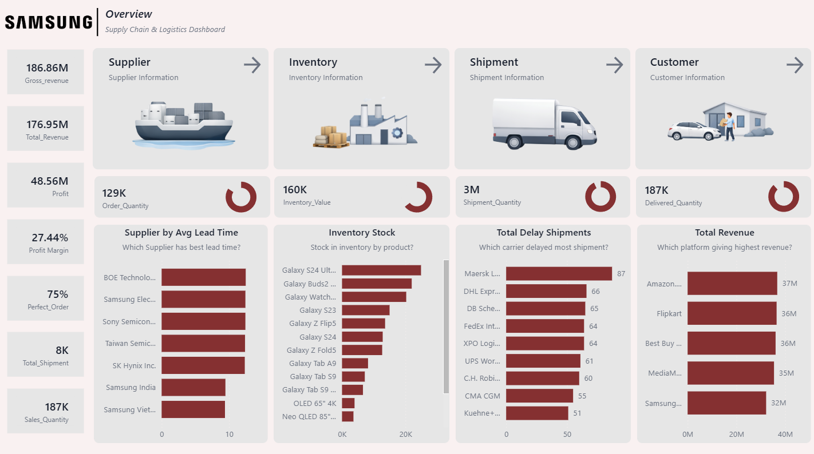

# Samsung Supply Chain and Logistics Dashboard

## Project Overview

This project presents an interactive Power BI dashboard designed to analyze Samsung's supply chain and logistics performance. The dashboard integrates operational, financial, and logistics data to provide insights into supplier performance, inventory levels, shipment tracking, and revenue distribution across sales platforms.

The dashboard highlights key performance indicators such as revenue, profit, shipment quantities, and inventory values. It allows business users to monitor supply chain efficiency, identify shipment delays, evaluate supplier performance, and analyze sales channel revenue distribution.

By transforming raw operational data into interactive visual insights, the dashboard supports data-driven decision-making and helps improve supply chain efficiency.

## Business Problem

Large organizations like Samsung manage complex supply chains involving multiple suppliers, logistics partners, and sales channels. Without centralized analytics, it becomes difficult to monitor supplier performance, track shipment delays, and manage inventory efficiently.

The goal of this dashboard is to provide a centralized analytics platform that enables stakeholders to:

- Monitor revenue and profit performance
- Evaluate supplier lead times
- Track shipment delays across logistics providers
- Analyze product inventory levels
- Identify top-performing sales platforms
- Improve operational efficiency across the supply chain

## Dashboard Preview

## Key Performance Indicators (KPIs)

Gross Revenue: 186.86M  
Total Revenue: 176.95M  
Profit: 48.56M  
Profit Margin: 27.44%

Operational Metrics:

- Order Quantity: 129K  
- Inventory Value: 160K  
- Shipment Quantity: 3M  
- Delivered Quantity: 187K  
- Total Shipments: 8K  
- Sales Quantity: 187K  

Perfect Order Rate: 75%

## Dashboard Sections

### Supplier Analysis
Evaluates supplier performance using average lead time to identify vendors with faster delivery performance.

### Inventory Management
Displays stock levels for Samsung products including Galaxy smartphones, tablets, and other electronic products to monitor inventory distribution and product demand.

### Shipment Monitoring
Tracks shipment quantities and identifies logistics carriers responsible for delayed shipments, helping improve delivery performance.

### Customer and Revenue Analysis
Analyzes revenue generated from various sales platforms including Amazon, Flipkart, Best Buy, and other retail channels.

### Operational KPIs
Displays key operational metrics such as perfect order rate, shipment counts, and order quantities to measure supply chain performance.

## Key Insights

- Amazon generates the highest revenue among all sales platforms, contributing approximately 37M in total revenue.
- Flipkart and Best Buy follow closely as major revenue-generating platforms.
- Certain logistics providers such as Maersk and DHL Express show higher shipment delays compared to other carriers.
- High-demand products such as the Galaxy S24 series contribute significantly to the total inventory value.
- Supplier lead time analysis highlights vendors that deliver materials faster, helping optimize procurement efficiency.
- The perfect order rate of 75 percent indicates opportunities to improve order fulfillment and logistics coordination.

## Tools and Technologies Used

- Microsoft Power BI  
- Data Modeling  
- DAX (Data Analysis Expressions)  
- Interactive Data Visualization  

## How to Use

1. Download the Power BI file from this repository.
2. Open the file using Microsoft Power BI Desktop.
3. Connect to the dataset if prompted.
4. Refresh the data model.
5. Explore the dashboard using interactive visuals and filters.

## Project Purpose

This project demonstrates practical skills in:

- Supply Chain Analytics
- Business Intelligence Dashboard Development
- Data Visualization and KPI Monitoring
- Logistics and Inventory Performance Analysis
- Power BI Data Modeling and Interactive Reporting
